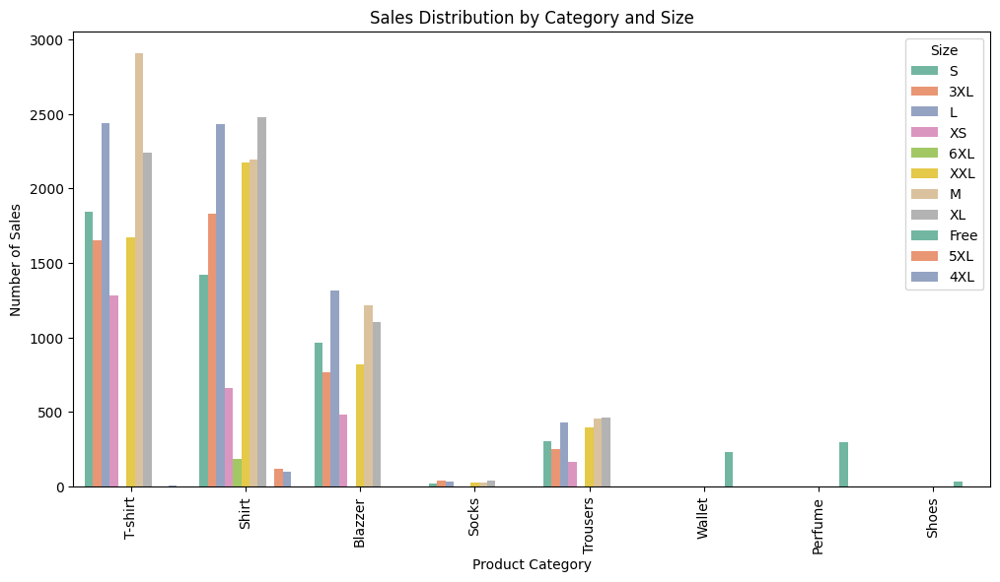
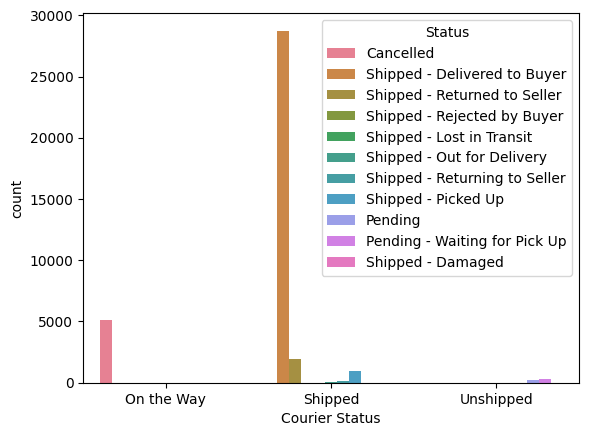
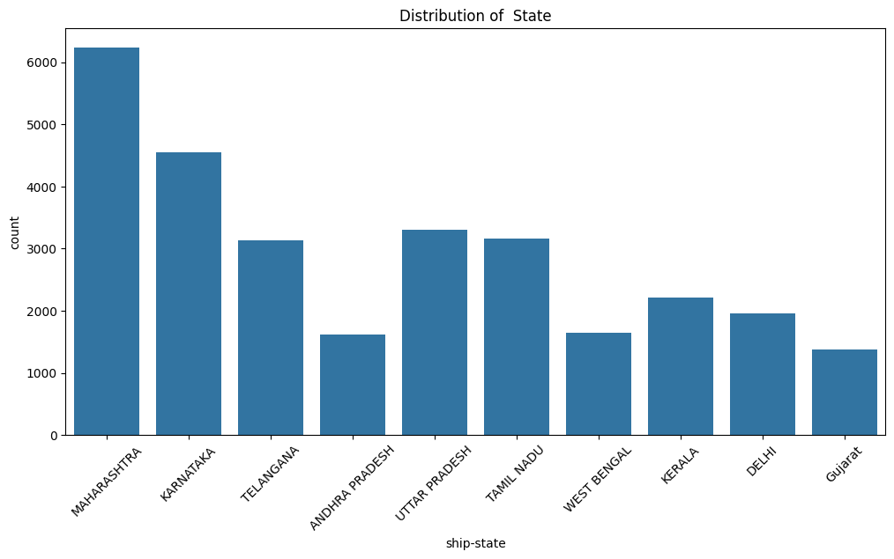

# Amazon Sales Report Analysis

## 1. Introduction
This project provides a comprehensive analysis of the Amazon Sales Report dataset to derive key business insights. By using Python libraries such as Pandas and Matplotlib, this analysis aims to identify trends in customer purchasing behavior, sales performance across different regions and channels, and the effectiveness of various product categories. The goal is to provide a clear, data-backed understanding of the sales landscape to inform strategic business decisions.

## 2.Data Source
The data for this project was obtained from https://www.kaggle.com/datasets/ashrafasadofficial/amazon-sales-report?select=Amazon+Sale+Repor.csv. The dataset contains 128977 rows and 21 columns including index, Order ID, Date, Status,Fulfilment, Sales Channel, ship-service-level, Category, Size, Courier Status, Qty, currency, Amount, ship city, ship-state, ship-postal-code, ship-country, B2B, fulfilled-by, New, PendingS.

## 3.Data Cleaning and Transformation
The raw data underwent several crucial cleaning and transformation steps to ensure accuracy, consistency, and suitability for analysis. This included:

**Column Removal:** The New and PendingS columns were identified as having no useful data (all null values) and were subsequently removed from the DataFrame.

**Handling Missing Values:** Rows containing any missing values were removed using the dropna() method. This step was crucial to ensure that subsequent calculations and visualizations were based on complete records.

**Data Type Conversion:** To enable proper analysis, the data types of key columns were converted. The ship-postal-code column was converted from a floating-point number to an integer, and the Date column was converted to a datetime object, which is essential for any time-series analysis.

## 4.Analysis and Methodology
The analysis was performed by leveraging Python's data science libraries. Pandas was used extensively for data manipulation, including filtering, grouping, and aggregation. Matplotlib and Seaborn were the primary tools for data visualization, allowing for a clear and intuitive representation of the findings. The analysis focused on answering key business questions by aggregating data and visualizing the results through various charts.

## 5.Answering Key Business Questions with Visualizations

### Question 1: What are the most popular product sizes?
A bar chart showing the count of each product size revealed that sizes L and M were the top sellers, indicating high demand for these specific fits.

### Question 2: Which product categories are most popular by size?
By adding a Category hue to the size count plot, the analysis showed which specific product categories drive sales for each size. For example, it became clear that T-shirts are a significant driver of sales in the popular 'M' size.

### Question 3: Which courier status has the highest number of orders?
Most orders fall under “Shipped – Delivered to Buyer”, indicating strong delivery success.

### Question 4: Which states generate the most sales?
A bar chart was created to visualize the total quantity of products sold in the top 10 states. This chart clearly identified the top-performing regions, with Maharashtra, Karnataka, and Uttar Pradesh leading in sales volume.

### Question 5: What percentage of total orders are B2B compared to Non-B2B?
About 99.2% of orders are Non-B2B, while only 0.8% are B2B.

